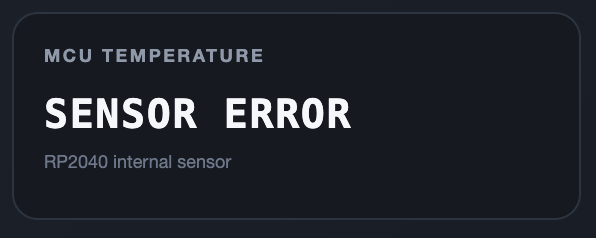

# Changelog

All notable changes to this project will be documented in this file.

This project follows the principles of **Keep a Changelog** and uses **Semantic Versioning (SemVer)**.

---

## [2.0.2 - STABLE] - 2026-08-05

### 🚀 Removed

1. DMX Engine
  - Removed the experimental `spin_try_lock()` and direct hardware-register
  spinlock helper used by earlier v2.0.2 test builds.
  - Uses the official Pico SDK `spin_lock_blocking()` / `spin_unlock()` pair.
  - Core 1 now enters the shared-buffer lock only when a new 40 Hz DMX frame is
  due, instead of claiming the lock continuously in every Core 1 loop.

2. The temperature feature has been completely removed from:
  - ADC initialization and runtime;
  - diagnostics structure;
  - REST API;
  - dashboard interface.
This avoids the unusable ADC subsystem on the tested OEM RP2040 board.

### 🚀 Improved

- Added a 35 ms PIO/FIFO timeout and automatic state-machine recovery.
- Preserved the original PIO program, 105 us BREAK, 14 us MAB, 513-byte DMX
  frame, four output pins, and approximately 40 Hz frame schedule.
- Core 1 loop and heartbeat diagnostics use atomic counters.
- Added a controlled watchdog reboot if Core 1 stops producing heartbeat for
  three consecutive seconds.
- Uses the RP2040 64-bit hardware timer `time_us_64()`.
- The authoritative uptime resets only when the MCU loses power or reboots.
- The browser stores the latest uptime snapshot in `localStorage`.
- After a hard refresh, the dashboard restores the continuing value while
  waiting for the node API, then synchronizes to the node value.
- The dashboard HTML is gzip-compressed inside the firmware.
- Transfer size is reduced from about 34 KB to about 9 KB.
- The browser may cache the static dashboard for one hour.
- `/api/status` remains live and uncached.
- Added strict sACN property-length and packet-boundary validation.
- Malformed or truncated sACN packets are rejected before reading DMX slots.

## Validation completed in this environment

- Dashboard JavaScript passed `node --check`.
- Temperature code and API fields are fully removed.
- Old experimental `spin_try_lock`, `spin_unlock_unsafe`, and custom lock
  helper are absent.

## [2.0.2] - 2026-08-02

### 🚀 Improved

- RP2040 internal temperature sensor read directly from ADC4 with trimmed averaging, plausibility checks and JSON-safe error reporting.

  

- System uptime comes from the RP2040 64-bit hardware timer and continues correctly when the dashboard is closed, reopened or refreshed.

## [2.0.1] - 2026-08-01

### ✨ Added

- Redesigned industrial-style Web Dashboard.
- Added real-time MCU temperature monitoring.
- Added DMX Output FPS monitoring.
- Added Input Packet FPS monitoring.
- Added Last Packet Age indicator.
- Added Source Quality status.
- Added Event Log panel.
- Added Port Output Test Mode:
  - Stop
  - Blackout
  - 50%
  - Full
  - Chase
- Added Channel Activity visualization.
- Added Device Information section.
- Added Firmware Version display.
- Added REST API improvements for diagnostics.

### 🚀 Improved

- Improved Web Dashboard layout with industrial UI.
- Changed typography:
  - Headline → Impact
  - Body → Helvetica Neue
  - Technical Data → Consolas
- Improved JSON API structure.
- Improved temperature filtering.
- Improved DMX statistics update.
- Improved responsiveness for desktop and tablet browsers.
- Improved system diagnostics.

### 🛠 Fixed

- Fixed MCU temperature reading showing invalid values.
- Fixed JSON output when temperature sensor returns invalid data.
- Fixed Dashboard rendering issues.
- Fixed HTML generation reliability.
- Fixed packet statistics synchronization.
- Fixed Web API stability.

---

## [2.0.0] - 2026-05-30

### 🎉 Initial Public Release

First public release of **ND DMX NODE 4U**.

### ✨ Features

- Raspberry Pi Pico based Art-Net / sACN to DMX Node.
- 4 Independent DMX512 Outputs.
- W5500 Ethernet Interface.
- Art-Net Protocol Support.
- sACN (E1.31) Protocol Support.
- Dual-Core Processing.
- PIO-based DMX512 Engine.
- Double Buffer DMX Architecture.
- Real-time Universe Mapping.
- Web Configuration Interface.
- Static IP Configuration.
- EEPROM Configuration Storage.
- Watchdog Protection.
- Network Diagnostics.
- Merge Mode Support.
- Automatic Source Detection.

### ⚡ Performance

- DMX Refresh Rate ~40 FPS.
- 512 Channels per Universe.
- Low-latency Ethernet Processing.
- Independent DMX Output Engine running on Core 1.

### 🔧 Hardware

- Raspberry Pi Pico
- W5500 Ethernet Module
- 4× Auto Direction RS485 Modules
- 4× DMX512 5-Pin XLR Outputs
- 7–12V DC Input

---

## Future Roadmap

### Planned for v2.1

- RDM Preparation
- DHCP Support
- Configuration Backup / Restore
- Password Protection
- User Login
- Dark / Light Theme
- SNMP Monitoring
- NTP Synchronization
- Improved Event Logger
- Hardware Monitoring
