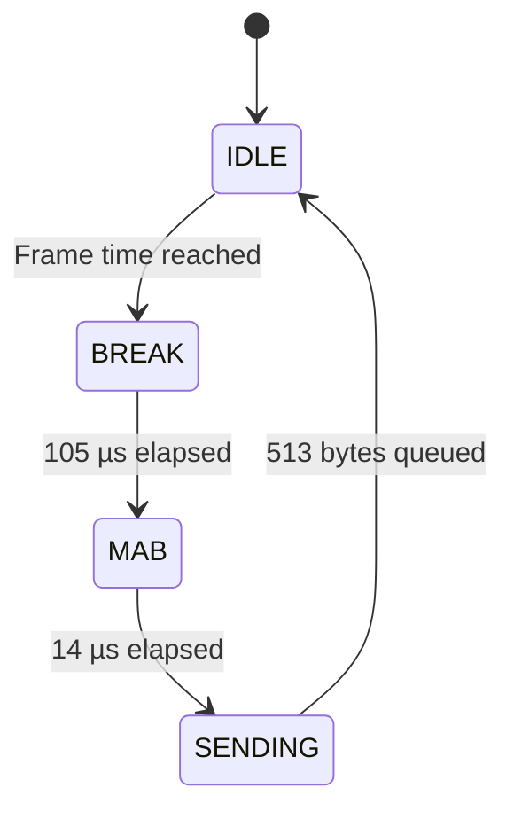

# ND-PicoDMX-System

<p align="center">
  <strong>Budget-friendly, DIY 4-port Art-Net / sACN to DMX512 node built around the Raspberry Pi Pico with live web dashboard for only 45$.</strong><br>
  <strong>Node DMX512 4 cổng giá rẻ chỉ 1.200.000 VND, dễ dàng DIY với giao diện quản lý web, sử dụng Raspberry Pi Pico.</strong>
</p>

<p align="center">
  
  
  
  
  
</p>

<p align="center">
  <a href="#english">English</a> · <a href="#tieng-viet">Tiếng Việt</a>
</p>

> [!IMPORTANT]
> This README documents firmware **v2.0.1 (`2.0.1-temp-fix`)**. The node uses transmit-only, auto-direction RS485 modules. **RDM is not supported** by this hardware arrangement because no dedicated DE/RE control and no DMX receive path are used.
>
> README này mô tả firmware **v2.0.1 (`2.0.1-temp-fix`)**. Node sử dụng module RS485 auto-direction theo hướng chỉ phát. **Không hỗ trợ RDM** vì phần cứng không có điều khiển DE/RE riêng và không sử dụng đường nhận DMX.

---

<a id="english"></a>
# English Documentation

## Table of Contents

1. [Overview](#1-overview)
2. [DMX Fundamentals](#2-dmx-fundamentals)
3. [How DMX Works Inside the Firmware](#3-how-dmx-works-inside-the-firmware-firmware-internals)
4. [Key Features](#4-key-features)
5. [Hardware BOM](#5-hardware-bom)
6. [Pinout & Wiring](#6-pinout--wiring)
7. [Build & Compilation Guide](#7-build--compilation-guide)
8. [REST API Documentation](#8-rest-api-documentation)
9. [Network Defaults](#9-network-defaults)

---

## 1. Overview

**ND-PicoDMX-System** is a compact four-output network DMX node based on:

- **Raspberry Pi Pico / RP2040** for dual-core processing and PIO-based serial timing.
- **W5500 Ethernet** for wired Art-Net and sACN reception.
- **Four auto-direction TTL-to-RS485 modules** for four independent DMX512 outputs.
- A local, responsive **web dashboard** stored directly in firmware flash.

The project is designed to be:

- 💸 **Budget-friendly** — built from common modules instead of a custom PCB.
- 🧰 **DIY-friendly** — simple point-to-point wiring and Arduino IDE compilation.
- 🎛️ **Lighting-console friendly** — accepts both Art-Net and sACN/E1.31.
- 🌐 **Easy to configure** — live status, routing, diagnostics and output tests from a browser.
- ⚙️ **Timing-safe** — network/web work runs on Core 0, while DMX generation runs independently on Core 1 and PIO.

### Data path

```text
Lighting console / software
        │
        ├── Art-Net UDP 6454
        └── sACN UDP 5568
                │
             W5500
                │ SPI
             RP2040
        ┌───────┴────────┐
        │                │
   Core 0            Core 1 + PIO
Network / Web      DMX timing engine
        │                │
  Back buffers      Front buffers
        └──── spinlock ──┘
                │
       GP8 / GP9 / GP14 / GP15
                │
      4 × auto-direction RS485
                │
       4 × XLR-5 DMX outputs
```

> [!NOTE]
> The web dashboard is diagnostic and configuration software. It does not generate DMX timing in the browser. DMX continues to run on Core 1 even while the dashboard is open.

---

## 2. DMX Fundamentals

DMX512 is a unidirectional digital lighting-control protocol. One DMX universe carries up to **512 control slots**, commonly called channels.

### DMX electrical and serial basics

| Item | Value used by this firmware |
|---|---:|
| Physical layer | RS485 differential signalling |
| Baud rate | 250,000 bit/s |
| Serial format | 8 data bits, no parity, 2 stop bits — **8N2** |
| Start code | `0x00` for standard lighting data |
| Maximum channel slots | 512 |
| Bytes per full frame | 513: one start code + 512 channel bytes |
| Bit duration | 4 µs |
| Slot duration | Approximately 44 µs |
| Firmware BREAK | 105 µs |
| Firmware MAB | 14 µs |
| Output refresh period | 25 ms, approximately 40 Hz |

### Frame structure

```text
MARK / Idle HIGH
      │
      ├── BREAK: line LOW for 105 µs
      ├── MAB:   line HIGH for 14 µs
      ├── Start Code: 0x00
      ├── Channel 1
      ├── Channel 2
      ├── ...
      └── Channel 512

The sequence repeats approximately every 25 ms.
```

Each channel is an 8-bit value:

| Value | Percentage | Typical meaning |
|---:|---:|---|
| `0` | 0% | Off / minimum |
| `128` | About 50% | Mid-level |
| `255` | 100% | Full |

### DMX connector pinout

The node uses female XLR-5 panel connectors as DMX outputs.

| XLR-5 pin | Signal | Connection |
|---:|---|---|
| 1 | Common / shield | RS485 module GND / signal common |
| 2 | Data− | RS485 `B−` |
| 3 | Data+ | RS485 `A+` |
| 4 | Secondary data pair, unused | No connection |
| 5 | Secondary data pair, unused | No connection |

> [!WARNING]
> DMX termination belongs at the **last receiver on the cable**, normally 120 Ω between pins 2 and 3. Do not place permanent 120 Ω termination on every output unless the output stage was intentionally designed for it.

---

## 3. How DMX Works Inside the Firmware — Firmware Internals

### 3.1 Dual-core architecture

The firmware divides work between the two RP2040 cores:

| Processing block | Responsibility |
|---|---|
| **Core 0** | W5500 SPI, Art-Net, sACN, web server, REST API, EEPROM, telemetry and event log |
| **Core 1** | Four-port non-blocking DMX state machines |
| **PIO0 / PIO1** | Hardware-timed 250 kbit/s 8N2 payload transmission |

This separation prevents browser traffic or packet parsing from directly disturbing DMX bit timing.

### 3.2 PIO UART transmitter

Each DMX output is driven by a PIO state machine. The PIO clock divider produces a **1 MHz state-machine clock**, so one PIO cycle equals 1 µs. Four PIO cycles form one 4 µs DMX bit.

The compact PIO program performs:

1. `pull block` — wait for the next byte from the TX FIFO.
2. Drive the start bit LOW.
3. Shift eight data bits LSB-first to the output pin.
4. Drive two stop bits HIGH.
5. Return to MARK/idle while waiting for another byte.

PIO assignment:

| DMX port | GPIO | PIO block | State machine |
|---:|---:|---|---:|
| 1 | GP8 | PIO0 | SM0 |
| 2 | GP9 | PIO0 | SM1 |
| 3 | GP14 | PIO1 | SM0 |
| 4 | GP15 | PIO1 | SM1 |

### 3.3 Per-port DMX state machine

Every port cycles through four states:



- **IDLE**: prepare the front buffer and wait for the 25 ms frame deadline.
- **BREAK**: switch the GPIO from PIO to normal GPIO and pull it LOW for 105 µs.
- **MAB**: pull the GPIO HIGH for 14 µs.
- **SENDING**: return ownership to PIO and feed start code plus 512 channel bytes into the TX FIFO.

The firmware feeds no more than 16 bytes per loop pass, keeping Core 1 fair across all four outputs.

### 3.4 Double buffering

Each port contains:

- `dmxBuffer[513]`: back buffer written by Core 0 from network packets.
- `activeDmxBuffer[513]`: front buffer transmitted by Core 1.
- `hasNewData`: flag indicating a new network frame is ready.

A hardware spinlock protects the buffer copy. Core 1 copies the back buffer only at a safe frame boundary, then keeps transmitting the front buffer continuously.

This means:

- A partial network update cannot tear a DMX frame.
- Output remains continuous when the lighting scene is static.
- Brief packet gaps do not immediately interrupt the DMX line.

### 3.5 Art-Net processing

The firmware listens on UDP port **6454** and supports:

- `ArtDmx` (`OpCode 0x5000`) for channel data.
- `ArtPoll` (`OpCode 0x2000`) and an `ArtPollReply` response for node discovery.

The received Art-Net Port-Address is compared with the configured port universe.

> [!TIP]
> Some controllers display Art-Net universes from 0 while others display them from 1. If the output appears one universe off, check the controller's Art-Net numbering convention.

### 3.6 sACN / E1.31 processing

The firmware listens on UDP port **5568** using:

- One unicast sACN socket.
- Up to four multicast sockets, one for each configured universe.

Multicast addresses follow:

```text
239.255.<Universe High Byte>.<Universe Low Byte>
```

The parser reads the universe, priority and DMX property values from the E1.31 packet. The start code is excluded from the incoming property list before copying channel data into the local 513-byte DMX buffer, whose index 0 remains the standard `0x00` start code.

### 3.7 Protocol selection and merge behavior

Each port can be configured as:

| Mode | Value | Behavior |
|---|---:|---|
| AUTO | `0` | Accept Art-Net or sACN |
| Art-Net only | `1` | Reject sACN for this port |
| sACN only | `2` | Reject Art-Net for this port |

Merge policy:

| Policy | Value | Current firmware behavior |
|---|---:|---|
| LTP | `0` | Latest accepted packet replaces the back buffer |
| HTP | `1` | Higher values overwrite lower values in the current back buffer |
| BLOCK | `2` | First active source IP is accepted; a second source is blocked while the first remains active |

For sACN, packets with lower priority than the currently active sACN source are ignored during the active-source window.

> [!NOTE]
> The current HTP implementation is intentionally lightweight and does not keep a separate 512-channel buffer for every sender. It should be treated as a simplified embedded HTP mode rather than a full multi-source merge engine.

### 3.8 Source health and conflict detection

- A source is marked inactive after **1 second** without a packet.
- A second sender IP detected within the active one-second window raises a conflict flag.
- The conflict flag clears two seconds after duplicate-source traffic stops.
- Dashboard input FPS counts received network packets.
- DMX output FPS is counted separately from actual Core 1 frame starts.

### 3.9 Local output test modes

The web dashboard can override each output locally:

| Mode | API value | Output |
|---|---:|---|
| NETWORK / STOP | `0` | Resume network buffer |
| BLACKOUT | `1` | All channels `0` |
| 50% | `2` | All channels `128` |
| FULL | `3` | All channels `255` |
| CHASE | `4` | One channel at `255`, advancing every 100 ms |

Network data continues updating the back buffer during a local test. When the test stops, the port returns to the latest received network data.

### 3.10 Temperature telemetry

Firmware v2.0.1 reads the RP2040 internal temperature sensor with `analogReadTemp(3.3f)`, discards the first conversion, averages valid samples and returns JSON `null` if no valid reading is available. The dashboard displays `SENSOR ERROR` instead of an invalid extreme value.

The internal sensor is useful for trend monitoring, not precision ambient measurement.

---

## 4. Key Features

| Feature | Description |
|---|---|
| 🎚️ Four independent DMX outputs | GP8, GP9, GP14 and GP15 drive four RS485 transmitters |
| 🌐 Art-Net reception | ArtDmx input and ArtPollReply discovery on UDP 6454 |
| 📡 sACN / E1.31 reception | Unicast plus per-universe multicast on UDP 5568 |
| ⚙️ RP2040 dual-core architecture | Core 0 handles network/web; Core 1 handles DMX |
| ⏱️ PIO-timed DMX | Hardware-timed 250 kbit/s, 8N2 payload |
| 🔁 Continuous 40 Hz output | Repeats the current frame even when the scene does not change |
| 🧠 Double buffering | Prevents torn frames between network and output cores |
| 🔀 Per-port protocol selection | AUTO, Art-Net only or sACN only |
| 🧩 Routing modes | Sequential universes or manual universe per port |
| ⚔️ Conflict handling | LTP, simplified HTP or first-source BLOCK |
| 🚦 Source diagnostics | Sender IP, packet age, input FPS, output FPS and sACN priority |
| 🧪 Output test tools | Blackout, 50%, full and channel chase |
| 🖥️ Local web dashboard | No CDN, no external fonts and no Internet requirement |
| 📦 Flash-resident UI | Dashboard is stored as one static document in firmware |
| 🧱 Chunked web transfer | 512-byte Ethernet writes with UDP service between chunks |
| 💾 EEPROM configuration | Routing, universe, protocol, enable state and merge policy persist |
| 📝 Event log | Ten-entry circular RAM log |
| 🌡️ MCU temperature | Filtered RP2040 internal temperature telemetry |
| 🛡️ Watchdog | Hardware watchdog and Core 1 heartbeat monitoring |

### Current limitations

- Static IPv4 configuration only; no DHCP in v2.0.1.
- No RDM because the hardware is transmit-only and has no dedicated DE/RE or RX path.
- No galvanic isolation unless the selected RS485 modules specifically provide it.
- The web API changes state through HTTP GET requests for embedded simplicity. Keep the node on a trusted lighting-control LAN.
- Temperature is an internal RP2040 estimate, not calibrated enclosure temperature.

---

## 5. Hardware BOM

| Qty. | Component | Minimum recommendation | Purpose / notes |
|---:|---|---|---|
| 1 | [Raspberry Pi Pico](https://vi.aliexpress.com/item/1005012706861207.html)| Standard RP2040 Pico, 2 MB flash | Main processor |
| 1 | [Pico expansion board](https://vi.aliexpress.com/item/1005005292085342.html) | 7–12 V DC input with regulated rails | Accepts the 12 V node branch and powers the Pico system |
| 1 | [W5500 Ethernet module](https://vi.aliexpress.com/item/1005012641099047.html) | SPI module, 3.3 V logic | Wired network interface |
| 4 | [Auto-direction TTL-to-RS485 modules](https://vi.aliexpress.com/item/1005003056616563.html) | 250 kbit/s or faster, compatible with 3.3 V logic | One transmitter per DMX output |
| 4 | [XLR-5 female panel connectors](https://vi.aliexpress.com/item/1005004974465236.html) | Metal or quality plastic chassis type | DMX output connectors |
| 1 | 12 V DC router | LAN router with matching supply voltage | Connects node and lighting controller |
| 1 | [12 V DC power supply](https://vi.aliexpress.com/item/1005010390772322.html) | Sized for router + node; typically 2 A or greater after calculation | Main system supply |
| 1 | [Two-way fused power distribution](https://vi.aliexpress.com/item/1005009381318344.html) | Separate fuse for node and router branches | Splits the 12 V input safely |
| 1 | [Ethernet cable](https://vi.aliexpress.com/item/1005003335746833.html) | Cat5e or Cat6 | W5500 to router |
| 1 set | [Hook-up wire and connectors](https://vi.aliexpress.com/item/1005002984683377.html) | Short TTL/SPI wires, suitable gauge power wire | Internal wiring |
| 1 | 3D Print Enclosure | Ventilated metal/plastic project enclosure | Mechanical protection |
| Optional | External status LED + resistor | 220 Ω–1 kΩ series resistor | Use a genuinely exposed GPIO; see GP23 warning below |
| Optional | 100 nF decoupling capacitors | One close to each module supply | Local high-frequency decoupling |
| Optional | Bulk capacitor | 220–470 µF on the regulated rail | Helps absorb load transients |
| Optional | DMX terminator | 120 Ω between XLR pins 2 and 3 | Use at the end of the DMX cable, not automatically at every node output |


> [!CAUTION]
> Confirm the actual supply requirements printed on your W5500 and RS485 modules. Module boards with similar appearance may use different regulators, transceivers and VCC ranges. RP2040 GPIO is 3.3 V logic and is not 5 V tolerant.

### Suggested 12 V power architecture

```text
12 V DC input
      │
      ├── Fuse A ──> Pico expansion-board 7–12 V input
      │                ├── Raspberry Pi Pico
      │                ├── W5500 module
      │                └── Four RS485 modules
      │
      └── Fuse B ──> 12 V router input
```

Use a supply with sufficient current for both branches and maintain solid ground connections on the low-voltage node side.

---

## 6. Pinout & Wiring

<p align="center">
  <a href="[https://github.com/duongtruongdp/ND-PicoDMX-System]"></a>
</p>

### W5500 ↔ Raspberry Pi Pico

| W5500 signal | Pico GPIO / rail | Firmware symbol | Function |
|---|---|---|---|
| MISO | GP16 | `PIN_MISO` | SPI data from W5500 to Pico |
| CS / SCS | GP17 | `PIN_CS` | W5500 chip select |
| SCK | GP18 | `PIN_SCK` | SPI clock |
| MOSI | GP19 | `PIN_MOSI` | SPI data from Pico to W5500 |
| RST | GP20 | `PIN_RST` | Hardware reset, active LOW |
| VCC | Module-dependent regulated rail | — | Follow the W5500 board marking |
| GND | Common GND | — | Logic and power reference |
| RJ45 | Router LAN port | — | Ethernet network connection |

### DMX output GPIO ↔ auto-direction RS485 modules

This table follows the tested project wiring: the Pico output is connected to the module pin marked **TXD**, while the module **RXD** pin is unused.

| DMX output | Pico GPIO | RS485 TTL pin | Other RS485 TTL connections | Function |
|---:|---:|---|---|---|
| Port 1 | GP8 | TXD | VCC → 3.3 V, GND → GND, RXD → NC | Universe output 1 |
| Port 2 | GP9 | TXD | VCC → 3.3 V, GND → GND, RXD → NC | Universe output 2 |
| Port 3 | GP14 | TXD | VCC → 3.3 V, GND → GND, RXD → NC | Universe output 3 |
| Port 4 | GP15 | TXD | VCC → 3.3 V, GND → GND, RXD → NC | Universe output 4 |

> [!WARNING]
> TTL pin naming is not consistent across inexpensive auto-direction RS485 modules. On some boards, the MCU transmit input may be labelled `RXD`, `DI` or `DIN` instead of `TXD`. This project documents the module revision that was tested successfully with **Pico GPIO → module TXD**. Verify the silkscreen or vendor diagram for your exact module before powering it.

### RS485 modules ↔ XLR-5 outputs

Repeat for all four ports:

| RS485 screw terminal | XLR-5 pin | DMX signal |
|---|---:|---|
| GND | 1 | Common / shield |
| B− | 2 | Data− |
| A+ | 3 | Data+ |
| — | 4 | Unused |
| — | 5 | Unused |

### Power wiring

| From | To | Function |
|---|---|---|
| 12 V supply positive | Two-way fused distribution input | Main positive feed |
| Distribution branch A | Expansion-board 7–12 V input | Powers node electronics |
| Distribution branch B | Router 12 V input | Powers router |
| 12 V supply negative | Expansion-board negative and router negative | Common low-voltage return |
| Expansion-board regulated 3.3 V | Four RS485 VCC pins, if supported by modules | RS485 logic/transceiver power |
| Expansion-board regulated rail | W5500 VCC according to module marking | Ethernet module power |

### Status pin warning: GP23

The current firmware defines:

```cpp
#define HARDWARE_LED_PIN 23
```

and toggles that pin every 300 ms. On a **standard Raspberry Pi Pico**, GP23 is an internal board signal connected to the SMPS power-save control and is not available on the normal 40-pin header. It should not be treated as an external LED pin.

For a standard Pico, choose one of these options before final hardware assembly:

1. Change `HARDWARE_LED_PIN` to **GP25** to use the Pico's onboard LED.
2. Change it to another unused, exposed GPIO and connect an external LED through a current-limiting resistor.
3. Disable the heartbeat LED code if all exposed GPIOs are required.

The current blink pattern is a simple firmware heartbeat: approximately 300 ms ON and 300 ms OFF. It indicates that Core 0 is looping; it does **not** directly indicate DMX packet activity.

---

## 7. Build & Compilation Guide

### 7.1 Required software

- Arduino IDE 2.x.
- Raspberry Pi Pico/RP2040 Arduino core by Earle F. Philhower.
- Arduino `Ethernet` library with W5500 support.
- The firmware `.ino` file from this repository.

No external DMX library is required. DMX generation is implemented directly with RP2040 PIO and the dual-core runtime.

### 7.2 Install the RP2040 board package

In Arduino IDE:

1. Open **Arduino IDE → Settings / Preferences**.
2. Add this Boards Manager URL:

   ```text
   https://github.com/earlephilhower/arduino-pico/releases/download/global/package_rp2040_index.json
   ```

3. Open **Boards Manager**.
4. Search for **Raspberry Pi Pico/RP2040/RP2350**.
5. Install the package by **Earle F. Philhower**.

### 7.3 Install the Ethernet library

Open **Library Manager**, search for **Ethernet**, and install the Arduino Ethernet library.

### 7.4 Recommended Arduino settings

For a standard Raspberry Pi Pico:

| Setting | Value |
|---|---|
| Board | Raspberry Pi Pico |
| CPU Speed | 133 MHz |
| Flash Size | 2 MB, no filesystem required |
| USB Stack | Pico SDK |
| Optimize | Small (`-Os`) |
| Serial Monitor | 115200 baud |

> [!IMPORTANT]
> Do not select a 16 MB flash layout for a standard 2 MB Raspberry Pi Pico. EEPROM emulation depends on the configured flash layout.

### 7.5 Compile and upload

1. Place the firmware in a folder with the same base name as the `.ino` file.
2. Connect the Pico while holding **BOOTSEL** if no serial port is available.
3. Wait for the `RPI-RP2` drive to appear.
4. Click **Upload** in Arduino IDE.
5. After the UF2 copy completes, the drive disappears and the Pico reboots.
6. Open Serial Monitor at 115200 baud to inspect boot checkpoints.
7. Connect W5500 to the router and browse to:

   ```text
   http://10.10.10.10/
   ```
<p align="center">
  <a href="[https://github.com/duongtruongdp/ND-PicoDMX-System]"></a>
</p>

### 7.6 First test checklist

- [ ] W5500 link LEDs illuminate.
- [ ] `http://10.10.10.10/api/status` returns JSON.
- [ ] Dashboard reports `SYSTEM ONLINE`.
- [ ] Test mode `FULL` drives a connected fixture.
- [ ] Art-Net or sACN source appears with sender IP and FPS.
- [ ] All four ports report approximately 40 Hz DMX output.
- [ ] Temperature shows a reasonable value or `SENSOR ERROR`, never an extreme invalid number.

---

## 8. REST API Documentation

The HTTP server listens on TCP port **80**. The current firmware uses lightweight GET endpoints to simplify the embedded web stack.

> [!WARNING]
> There is no authentication or TLS. Operate the node only on a trusted, isolated lighting-control network.

### 8.1 `GET /api/status`

Returns current device, network, DMX-port and event-log telemetry.

Example:

```bash
curl http://10.10.10.10/api/status
```

Representative response:

```json
{
  "model": "ND DMX NODE 4U",
  "firmware": "2.0.1-temp-fix",
  "hardware": "RP2040 + W5500 + 4x RS485",
  "build": "Aug 01 2026 18:00:00",
  "mac": "02:4E:44:34:55:01",
  "ip": "10.10.10.10",
  "link": true,
  "mode": 0,
  "start": 1,
  "merge": 0,
  "uptime": 3600,
  "c0": 4200,
  "c1": 120000,
  "net": 850,
  "packets": 144000,
  "temp": 41.7,
  "ports": [
    {
      "port": 1,
      "en": 1,
      "pmode": 0,
      "universe": 1,
      "active": true,
      "conflict": false,
      "fps": 40.0,
      "dmxFps": 40.0,
      "used": 128,
      "age": 8,
      "prio": 100,
      "test": 0,
      "proto": "Art-Net",
      "sender": "10.10.10.20",
      "c_ip": "0.0.0.0"
    }
  ],
  "events": [
    {"t": 1000, "m": "System boot complete"}
  ]
}
```

`temp` is either a numeric Celsius value or JSON `null` when the internal sensor reading is invalid.

#### Status field reference

| Field | Meaning |
|---|---|
| `model` | Device model string |
| `firmware` | Firmware version |
| `hardware` | Hardware description |
| `build` | Compile date and time |
| `mac` | Ethernet MAC address |
| `ip` | Current local IPv4 address |
| `link` | W5500 physical link state |
| `mode` | Routing mode: `0` sequential, `1` manual |
| `start` | Sequential start universe |
| `merge` | `0` LTP, `1` HTP, `2` BLOCK |
| `uptime` | Seconds since boot |
| `c0`, `c1` | Core loop counters per reporting interval |
| `net` | Maximum measured network service time in µs |
| `packets` | Total accepted Art-Net/sACN packets |
| `temp` | RP2040 internal temperature in °C or `null` |
| `ports` | Array of four output status objects |
| `events` | Newest-first circular event log |

Per-port fields:

| Field | Meaning |
|---|---|
| `port` | Human-readable port number, 1–4 |
| `en` | Port enabled state, 0 or 1 |
| `pmode` | Protocol filter: 0 AUTO, 1 Art-Net, 2 sACN |
| `universe` | Routed universe |
| `active` | Network source received within one second |
| `conflict` | A second source IP was detected |
| `fps` | Accepted network packet FPS |
| `dmxFps` | Physical DMX frame-start FPS |
| `used` | Highest non-zero channel index, not a count of all non-zero channels |
| `age` | Milliseconds since last accepted packet |
| `prio` | Current sACN priority, or fixed Art-Net priority value |
| `test` | Local test mode 0–4 |
| `proto` | Active protocol name |
| `sender` | Current source IPv4 address |
| `c_ip` | Conflicting source IPv4 address |

### 8.2 `GET /api/test`

Changes local output-test mode.

Parameters:

| Parameter | Range | Meaning |
|---|---:|---|
| `p` | `0`–`3` | Zero-based output index |
| `m` | `0`–`4` | Test mode |

Test modes:

| `m` | Mode |
|---:|---|
| 0 | Stop test / resume network |
| 1 | Blackout |
| 2 | All channels 50% |
| 3 | All channels 100% |
| 4 | Channel chase |

Examples:

```bash
# Full output on physical Port 1
curl "http://10.10.10.10/api/test?p=0&m=3"

# Stop test and return Port 1 to network control
curl "http://10.10.10.10/api/test?p=0&m=0"
```

Success response:

```json
{"ok":true,"message":"Test mode updated"}
```

### 8.3 `GET /api/config`

Updates routing and persistent port configuration.

All parameters must be present because the firmware validates every port before saving.

| Parameter | Values | Meaning |
|---|---|---|
| `mode` | `0`, `1` | Sequential or manual routing |
| `start` | `1`–`63996` | Start universe for sequential mode |
| `merge` | `0`, `1`, `2` | LTP, HTP or BLOCK |
| `u0`…`u3` | `1`–`63999` | Manual universe for ports 1–4 |
| `e0`…`e3` | `0`, `1` | Disable or enable ports 1–4 |
| `p0`…`p3` | `0`, `1`, `2` | AUTO, Art-Net only or sACN only |

Example — sequential Universes 1–4, all ports enabled, AUTO protocol and LTP:

```bash
curl "http://10.10.10.10/api/config?mode=0&start=1&merge=0&u0=1&e0=1&p0=0&u1=2&e1=1&p1=0&u2=3&e2=1&p2=0&u3=4&e3=1&p3=0"
```

Success response:

```json
{"ok":true,"message":"Configuration saved"}
```

Saving configuration writes EEPROM and resets current network-source state for all ports.

### 8.4 Legacy and page routes

| Route | Behavior |
|---|---|
| `GET /` | Local dashboard |
| `GET /index.html` | Local dashboard |
| `GET /set?...` | Legacy configuration route; redirects to `/` after success |
| `GET /favicon.ico` | Returns HTTP 204 |
| Other routes | HTTP 404 `Not found` |

---

## 9. Network Defaults

### IPv4 defaults

| Setting | Default |
|---|---|
| Node IP | `10.10.10.10` |
| Subnet mask | `255.255.255.0` (`/24`) |
| Gateway | `10.10.10.1` |
| DNS server | `10.10.10.1` |
| MAC address | `02:4E:44:34:55:01` |
| HTTP dashboard | TCP 80 |
| Art-Net | UDP 6454 |
| sACN / E1.31 | UDP 5568 |
| Address mode | Static IPv4 |

Suggested computer settings for direct or router-based testing:

```text
IP address:  10.10.10.20
Subnet mask: 255.255.255.0
Gateway:     10.10.10.1
```

### Routing defaults after invalid or blank EEPROM

| Setting | Default |
|---|---|
| Routing mode | Sequential |
| Start universe | 1 |
| Port 1 universe | 1 |
| Port 2 universe | 2 |
| Port 3 universe | 3 |
| Port 4 universe | 4 |
| Port enabled | All ON |
| Protocol filter | AUTO on all ports |
| Merge policy | LTP |

### sACN multicast examples

| Universe | Multicast group |
|---:|---|
| 1 | `239.255.0.1` |
| 2 | `239.255.0.2` |
| 256 | `239.255.1.0` |

---

## References and inspiration

- Raspberry Pi Pico documentation: [Raspberry Pi documentation](https://www.raspberrypi.com/documentation/microcontrollers/pico-series.html)
- Arduino-Pico core documentation: [arduino-pico.readthedocs.io](https://arduino-pico.readthedocs.io/)

---

<p align="center">
  <strong>ND DMX SYSTEM · Built for practical DIY lighting control.</strong>
</p>