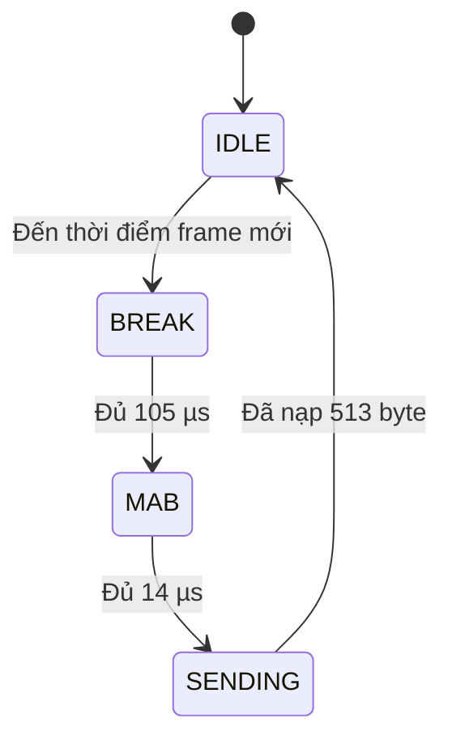

# ND-PicoDMX-System

<p align="center">
  <strong>Budget-friendly, DIY 4-port Art-Net / sACN to DMX512 node built around the Raspberry Pi Pico.</strong><br>
  <strong>Node DMX512 4 cổng thân thiện ngân sách, dễ DIY, sử dụng Raspberry Pi Pico.</strong>
</p>

<p align="center">
  
  
  
  
  
</p>

<p align="center">
  <a href="#english">English</a> · <a href="#tieng-viet">Tiếng Việt</a>
</p>

> [!IMPORTANT]
> This README documents firmware **v2.0.1 (`2.0.1-temp-fix`)**. The node uses transmit-only, auto-direction RS485 modules. **RDM is not supported** by this hardware arrangement because no dedicated DE/RE control and no DMX receive path are used.
>
> README này mô tả firmware **v2.0.1 (`2.0.1-temp-fix`)**. Node sử dụng module RS485 auto-direction theo hướng chỉ phát. **Không hỗ trợ RDM** vì phần cứng không có điều khiển DE/RE riêng và không sử dụng đường nhận DMX.

---

<a id="tieng-viet"></a>
# Tài Liệu Tiếng Việt

## Mục Lục

1. [Tổng Quan](#1-tổng-quan)
2. [Kiến Thức Nền Tảng Về DMX](#2-kiến-thức-nền-tảng-về-dmx)
3. [Cách Thức DMX Hoạt Động Trong Mã Nguồn](#3-cách-thức-dmx-hoạt-động-trong-mã-nguồn-firmware-internals)
4. [Tính Năng Nổi Bật](#4-tính-năng-nổi-bật)
5. [Danh Sách Phần Cứng — Hardware BOM](#5-danh-sách-phần-cứng--hardware-bom)
6. [Sơ Đồ Chân Kết Nối — Pinout & Wiring](#6-sơ-đồ-chân-kết-nối--pinout--wiring)
7. [Hướng Dẫn Build & Biên Dịch](#7-hướng-dẫn-build--biên-dịch)
8. [Tài Liệu REST API](#8-tài-liệu-rest-api)
9. [Cấu Hình Mạng Mặc Định](#9-cấu-hình-mạng-mặc-định)

---

## 1. Tổng Quan

**ND-PicoDMX-System** là bộ chuyển đổi Art-Net/sACN sang DMX512 gồm bốn cổng độc lập, được xây dựng từ:

- **Raspberry Pi Pico / RP2040** để xử lý hai nhân và tạo timing DMX bằng PIO.
- **W5500 Ethernet** để nhận dữ liệu Art-Net và sACN qua mạng LAN có dây.
- **Bốn module TTL-to-RS485 auto-direction** cho bốn đường DMX output.
- **Web dashboard nội bộ** được lưu trực tiếp trong flash của firmware.

Mục tiêu thiết kế:

- 💸 **Tiết kiệm chi phí** — sử dụng module phổ biến, không bắt buộc PCB tùy chỉnh.
- 🧰 **Dễ DIY** — đấu dây trực tiếp và biên dịch bằng Arduino IDE.
- 🎛️ **Tương thích phần mềm ánh sáng** — nhận Art-Net và sACN/E1.31.
- 🌐 **Dễ cấu hình** — theo dõi trạng thái, universe, diagnostics và test output trên trình duyệt.
- ⚙️ **Ưu tiên độ ổn định DMX** — Core 0 xử lý mạng/web; Core 1 và PIO độc lập xuất DMX.

### Luồng dữ liệu

```text
Console / phần mềm ánh sáng
        │
        ├── Art-Net UDP 6454
        └── sACN UDP 5568
                │
             W5500
                │ SPI
             RP2040
        ┌───────┴────────┐
        │                │
   Core 0            Core 1 + PIO
  Mạng / Web        Bộ máy timing DMX
        │                │
   Back buffer       Front buffer
        └──── spinlock ──┘
                │
       GP8 / GP9 / GP14 / GP15
                │
      4 × module RS485 auto-direction
                │
       4 × jack XLR-5 DMX output
```

> [!NOTE]
> Web dashboard chỉ làm nhiệm vụ cấu hình và chẩn đoán. Trình duyệt không tạo timing DMX. Core 1 vẫn tiếp tục phát DMX khi người dùng đang mở dashboard.

---

## 2. Kiến Thức Nền Tảng Về DMX

DMX512 là giao thức điều khiển ánh sáng kỹ thuật số một chiều. Một DMX universe có tối đa **512 slot điều khiển**, thường được gọi là channel.

### Thông số điện và serial

| Hạng mục | Giá trị firmware sử dụng |
|---|---:|
| Lớp vật lý | Tín hiệu vi sai RS485 |
| Baud rate | 250.000 bit/s |
| Định dạng serial | 8 data bit, không parity, 2 stop bit — **8N2** |
| Start code | `0x00` cho dữ liệu ánh sáng tiêu chuẩn |
| Số channel tối đa | 512 |
| Số byte mỗi frame đầy đủ | 513: một start code + 512 channel |
| Thời gian mỗi bit | 4 µs |
| Thời gian một slot | Khoảng 44 µs |
| BREAK trong firmware | 105 µs |
| MAB trong firmware | 14 µs |
| Chu kỳ refresh output | 25 ms, khoảng 40 Hz |

### Cấu trúc một frame DMX

```text
MARK / trạng thái nghỉ HIGH
      │
      ├── BREAK: kéo LOW trong 105 µs
      ├── MAB:   kéo HIGH trong 14 µs
      ├── Start Code: 0x00
      ├── Channel 1
      ├── Channel 2
      ├── ...
      └── Channel 512

Toàn bộ chuỗi được lặp lại khoảng mỗi 25 ms.
```

Mỗi channel là một giá trị 8 bit:

| Giá trị | Phần trăm | Ý nghĩa thường gặp |
|---:|---:|---|
| `0` | 0% | Tắt / mức thấp nhất |
| `128` | Khoảng 50% | Mức trung bình |
| `255` | 100% | Mức tối đa |

### Pin jack DMX XLR-5

Node sử dụng jack XLR-5 cái gắn panel làm DMX output.

| Chân XLR-5 | Tín hiệu | Kết nối |
|---:|---|---|
| 1 | Common / shield | GND / signal common của module RS485 |
| 2 | Data− | `B−` của module RS485 |
| 3 | Data+ | `A+` của module RS485 |
| 4 | Cặp dữ liệu phụ, không dùng | Không nối |
| 5 | Cặp dữ liệu phụ, không dùng | Không nối |

> [!WARNING]
> Điện trở termination DMX phải nằm ở **thiết bị nhận cuối cùng trên đường dây**, thông thường 120 Ω giữa chân 2 và 3. Không gắn cố định 120 Ω trên mọi cổng output nếu tầng output không được thiết kế riêng cho việc đó.

---

## 3. Cách Thức DMX Hoạt Động Trong Mã Nguồn — Firmware Internals

### 3.1 Kiến trúc hai nhân

Firmware chia nhiệm vụ như sau:

| Khối xử lý | Nhiệm vụ |
|---|---|
| **Core 0** | SPI W5500, Art-Net, sACN, web server, REST API, EEPROM, telemetry và event log |
| **Core 1** | Bốn state machine DMX không chặn luồng |
| **PIO0 / PIO1** | Truyền payload 250 kbit/s 8N2 với timing phần cứng |

Việc tách riêng giúp tải web và xử lý packet không trực tiếp làm sai timing bit DMX.

### 3.2 Bộ phát UART bằng PIO

Mỗi DMX output được điều khiển bởi một PIO state machine. Clock divider tạo clock PIO **1 MHz**, tương đương một chu kỳ PIO là 1 µs. Bốn chu kỳ PIO tạo thành một bit DMX dài 4 µs.

Chương trình PIO thực hiện:

1. `pull block` — chờ byte tiếp theo từ TX FIFO.
2. Phát start bit LOW.
3. Dịch tám data bit theo LSB-first ra GPIO.
4. Phát hai stop bit HIGH.
5. Giữ MARK/HIGH khi chờ byte tiếp theo.

Phân bổ PIO:

| Cổng DMX | GPIO | PIO | State machine |
|---:|---:|---|---:|
| 1 | GP8 | PIO0 | SM0 |
| 2 | GP9 | PIO0 | SM1 |
| 3 | GP14 | PIO1 | SM0 |
| 4 | GP15 | PIO1 | SM1 |

### 3.3 State machine của từng cổng



- **IDLE**: chuẩn bị front buffer và chờ mốc 25 ms.
- **BREAK**: chuyển GPIO khỏi PIO, kéo LOW trong 105 µs.
- **MAB**: kéo GPIO HIGH trong 14 µs.
- **SENDING**: trả GPIO cho PIO và nạp start code cùng 512 channel vào TX FIFO.

Mỗi lượt quét chỉ nạp tối đa 16 byte để Core 1 phục vụ công bằng cả bốn cổng.

### 3.4 Double buffering

Mỗi port có:

- `dmxBuffer[513]`: back buffer do Core 0 ghi từ packet mạng.
- `activeDmxBuffer[513]`: front buffer do Core 1 phát.
- `hasNewData`: cờ báo có frame mạng mới.

Spinlock phần cứng bảo vệ thao tác copy. Core 1 chỉ copy dữ liệu tại ranh giới frame an toàn rồi tiếp tục phát front buffer liên tục.

Kết quả:

- Không xuất hiện frame bị xé khi Core 0 đang cập nhật dữ liệu.
- Cảnh tĩnh vẫn được refresh liên tục.
- Mất packet ngắn không làm đường DMX tắt ngay lập tức.

### 3.5 Xử lý Art-Net

Firmware nghe UDP port **6454** và xử lý:

- `ArtDmx` (`OpCode 0x5000`) để nhận channel.
- `ArtPoll` (`OpCode 0x2000`) và trả `ArtPollReply` để phần mềm dò node.

Port-Address nhận được sẽ được so sánh với universe đã cấu hình của cổng.

> [!TIP]
> Có phần mềm hiển thị Art-Net universe từ 0, có phần mềm hiển thị từ 1. Nếu tín hiệu lệch một universe, hãy kiểm tra quy ước đánh số Art-Net của phần mềm điều khiển.

### 3.6 Xử lý sACN / E1.31

Firmware nghe UDP port **5568** bằng:

- Một socket sACN unicast.
- Tối đa bốn socket multicast, tương ứng universe của từng port.

Địa chỉ multicast:

```text
239.255.<Byte cao của Universe>.<Byte thấp của Universe>
```

Parser đọc universe, priority và property values. Start code trong packet được loại ra trước khi channel được copy vào buffer DMX 513 byte; byte index 0 của buffer vẫn là start code `0x00`.

### 3.7 Chọn protocol và merge

Mỗi port có các chế độ:

| Chế độ | Giá trị | Hành vi |
|---|---:|---|
| AUTO | `0` | Nhận Art-Net hoặc sACN |
| Chỉ Art-Net | `1` | Bỏ packet sACN ở port này |
| Chỉ sACN | `2` | Bỏ packet Art-Net ở port này |

Merge policy:

| Policy | Giá trị | Hành vi hiện tại |
|---|---:|---|
| LTP | `0` | Packet hợp lệ mới nhất thay thế back buffer |
| HTP | `1` | Giá trị cao hơn ghi đè giá trị thấp hơn trong back buffer hiện tại |
| BLOCK | `2` | Giữ IP nguồn đầu tiên; chặn IP thứ hai khi nguồn đầu vẫn active |

Với sACN, packet có priority thấp hơn nguồn sACN đang active sẽ bị bỏ trong cửa sổ nguồn active.

> [!NOTE]
> HTP hiện tại là phiên bản nhẹ dành cho embedded và không lưu riêng buffer 512 channel cho từng sender. Không nên xem đây là bộ merge đa nguồn đầy đủ như trên console chuyên nghiệp.

### 3.8 Theo dõi nguồn và conflict

- Port chuyển inactive sau **1 giây** không có packet.
- IP nguồn thứ hai xuất hiện trong cửa sổ một giây sẽ kích hoạt conflict.
- Conflict tự xóa sau hai giây không còn dữ liệu trùng nguồn.
- Input FPS là tốc độ packet mạng được chấp nhận.
- DMX Output FPS được đếm riêng theo số lần Core 1 bắt đầu frame thực tế.

### 3.9 Output Test cục bộ

| Chế độ | Giá trị API | Dữ liệu output |
|---|---:|---|
| NETWORK / STOP | `0` | Trở lại dữ liệu mạng |
| BLACKOUT | `1` | Toàn bộ channel bằng `0` |
| 50% | `2` | Toàn bộ channel bằng `128` |
| FULL | `3` | Toàn bộ channel bằng `255` |
| CHASE | `4` | Một channel bằng `255`, chuyển channel mỗi 100 ms |

Trong lúc test, dữ liệu mạng vẫn cập nhật back buffer. Khi dừng test, cổng trở lại dữ liệu mạng mới nhất.

### 3.10 Telemetry nhiệt độ

Firmware v2.0.1 đọc cảm biến nhiệt nội bộ RP2040 bằng `analogReadTemp(3.3f)`, bỏ mẫu đầu tiên, lấy trung bình các mẫu hợp lệ và trả JSON `null` nếu không đọc được. Dashboard sẽ hiện `SENSOR ERROR` thay vì một giá trị cực đoan sai.

Cảm biến này phù hợp để theo dõi xu hướng nhiệt, không phải cảm biến nhiệt độ môi trường chính xác.

---

## 4. Tính Năng Nổi Bật

| Tính năng | Mô tả |
|---|---|
| 🎚️ Bốn DMX output độc lập | GP8, GP9, GP14 và GP15 điều khiển bốn module RS485 |
| 🌐 Nhận Art-Net | ArtDmx và ArtPollReply trên UDP 6454 |
| 📡 Nhận sACN / E1.31 | Unicast và multicast theo universe trên UDP 5568 |
| ⚙️ Kiến trúc hai nhân RP2040 | Core 0 xử lý mạng/web; Core 1 xử lý DMX |
| ⏱️ Timing DMX bằng PIO | Payload 250 kbit/s, 8N2 bằng phần cứng |
| 🔁 Output liên tục khoảng 40 Hz | Vẫn phát frame khi cảnh không thay đổi |
| 🧠 Double buffering | Tránh frame bị xé giữa hai nhân |
| 🔀 Chọn protocol theo port | AUTO, chỉ Art-Net hoặc chỉ sACN |
| 🧩 Hai chế độ routing | Universe tuần tự hoặc universe riêng từng cổng |
| ⚔️ Xử lý conflict | LTP, HTP đơn giản hoặc BLOCK nguồn đầu tiên |
| 🚦 Diagnostics nguồn | IP sender, packet age, input FPS, output FPS và sACN priority |
| 🧪 Công cụ test output | Blackout, 50%, full và channel chase |
| 🖥️ Web dashboard nội bộ | Không cần CDN, font online hoặc Internet |
| 📦 UI nằm trong flash | Dashboard là một tài liệu tĩnh trong firmware |
| 🧱 Truyền web theo block | Block 512 byte, xử lý UDP xen kẽ |
| 💾 Lưu cấu hình EEPROM | Lưu routing, universe, protocol, enable và merge |
| 📝 Event log | Circular log cố định 10 sự kiện trong RAM |
| 🌡️ Nhiệt độ MCU | Lọc dữ liệu cảm biến nhiệt nội bộ RP2040 |
| 🛡️ Watchdog | Watchdog phần cứng và heartbeat của Core 1 |

### Giới hạn hiện tại

- Chỉ dùng IPv4 tĩnh; v2.0.1 chưa có DHCP.
- Không hỗ trợ RDM vì phần cứng chỉ phát, không có DE/RE riêng và đường RX DMX.
- Chỉ có cách ly galvanic nếu module RS485 thực tế hỗ trợ cách ly.
- REST API thay đổi cấu hình bằng HTTP GET để đơn giản hóa web server nhúng. Chỉ nên dùng node trong mạng lighting LAN đáng tin cậy.
- Nhiệt độ là giá trị ước tính bên trong RP2040, không phải nhiệt độ hộp được hiệu chuẩn.

---

## 5. Danh Sách Phần Cứng — Hardware BOM

| SL | Linh kiện | Yêu cầu tối thiểu | Mục đích / lưu ý |
|---:|---|---|---|
| 1 | Raspberry Pi Pico | Pico RP2040 tiêu chuẩn, flash 2 MB | Bộ xử lý chính |
| 1 | Expansion board cho Pico | Input DC 7–12 V, có rail ổn áp | Nhận nhánh nguồn 12 V và cấp nguồn hệ thống Pico |
| 1 | Module Ethernet W5500 | SPI, logic 3.3 V | Giao tiếp mạng LAN có dây |
| 4 | Module TTL-to-RS485 auto-direction | Tối thiểu 250 kbit/s, tương thích logic 3.3 V | Một module cho mỗi DMX output |
| 4 | Jack XLR-5 cái gắn panel | Loại chassis chất lượng tốt | Cổng DMX output |
| 1 | Router DC 12 V | Có cổng LAN | Kết nối node và máy điều khiển |
| 1 | Nguồn DC 12 V | Tính theo tổng router + node; thường từ 2 A sau khi tính tải | Nguồn chính |
| 1 | Bộ chia nguồn hai nhánh có cầu chì | Cầu chì riêng cho node và router | Chia nguồn 12 V an toàn |
| 1 | Dây mạng | Cat5e hoặc Cat6 | W5500 đến router |
| 1 bộ | Dây điện và terminal | Dây SPI/TTL ngắn, dây nguồn đúng tiết diện | Đấu nối bên trong |
| 1 | Hộp thiết bị | Có khe thông gió, có thể tự thiết kế hộp in 3D | Bảo vệ cơ khí |
| Tùy chọn | LED trạng thái + điện trở | Điện trở nối tiếp 220 Ω–1 kΩ | Dùng GPIO thực sự được đưa ra ngoài; xem cảnh báo GP23 |
| Tùy chọn | Tụ 100 nF | Một tụ gần nguồn mỗi module | Decoupling cao tần |
| Tùy chọn | Tụ nguồn lớn | 220–470 µF trên rail ổn áp | Hấp thụ tải biến thiên |
| Tùy chọn | Terminator DMX | 120 Ω giữa chân 2 và 3 | Dùng ở cuối dây DMX, không tự động gắn tại mọi output node |

> [!CAUTION]
> Kiểm tra đúng điện áp in trên module W5500 và RS485. Các module có hình thức giống nhau có thể sử dụng IC, regulator và dải VCC khác nhau. GPIO RP2040 dùng logic 3.3 V và không chịu được 5 V.

### Kiến trúc nguồn 12 V đề xuất

```text
Nguồn DC 12 V
      │
      ├── Cầu chì A ──> Input 7–12 V của expansion board Pico
      │                   ├── Raspberry Pi Pico
      │                   ├── Module W5500
      │                   └── 4 module RS485
      │
      └── Cầu chì B ──> Input 12 V của router
```

Chọn nguồn đủ dòng cho cả hai nhánh và giữ kết nối GND chắc chắn ở phần điện áp thấp của node.

---

## 6. Sơ Đồ Chân Kết Nối — Pinout & Wiring

<p align="center">
  <a href="[https://github.com/duongtruongdp/ND-PicoDMX-System]"></a>
</p>

### W5500 ↔ Raspberry Pi Pico

| Tín hiệu W5500 | GPIO / nguồn Pico | Tên trong firmware | Chức năng |
|---|---|---|---|
| MISO | GP16 | `PIN_MISO` | Dữ liệu SPI từ W5500 về Pico |
| CS / SCS | GP17 | `PIN_CS` | Chip select W5500 |
| SCK | GP18 | `PIN_SCK` | Clock SPI |
| MOSI | GP19 | `PIN_MOSI` | Dữ liệu SPI từ Pico sang W5500 |
| RST | GP20 | `PIN_RST` | Reset phần cứng, active LOW |
| VCC | Rail ổn áp đúng theo module | — | Làm theo ký hiệu trên module W5500 |
| GND | GND chung | — | Mốc nguồn và logic |
| RJ45 | Cổng LAN router | — | Kết nối Ethernet |

### GPIO DMX ↔ module RS485 auto-direction

Bảng dưới đây theo đúng wiring đã được dùng trong project: GPIO output của Pico nối vào chân module ghi **TXD**, chân **RXD** bỏ trống.

| DMX output | GPIO Pico | Chân TTL module RS485 | Kết nối TTL khác | Chức năng |
|---:|---:|---|---|---|
| Port 1 | GP8 | TXD | VCC → 3.3 V, GND → GND, RXD → không nối | Output universe 1 |
| Port 2 | GP9 | TXD | VCC → 3.3 V, GND → GND, RXD → không nối | Output universe 2 |
| Port 3 | GP14 | TXD | VCC → 3.3 V, GND → GND, RXD → không nối | Output universe 3 |
| Port 4 | GP15 | TXD | VCC → 3.3 V, GND → GND, RXD → không nối | Output universe 4 |

> [!WARNING]
> Tên chân TTL trên các module RS485 giá rẻ không thống nhất. Một số module dùng `RXD`, `DI` hoặc `DIN` làm đầu vào từ TX của vi điều khiển thay vì ghi `TXD`. README này mô tả revision đã test thành công theo cách **GPIO Pico → TXD module**. Hãy kiểm tra silkscreen hoặc tài liệu đúng của module trước khi cấp nguồn.

### Module RS485 ↔ jack XLR-5

Lặp lại cho cả bốn cổng:

| Cọc RS485 | Chân XLR-5 | Tín hiệu DMX |
|---|---:|---|
| GND | 1 | Common / shield |
| B− | 2 | Data− |
| A+ | 3 | Data+ |
| — | 4 | Không dùng |
| — | 5 | Không dùng |

### Đấu nguồn

| Từ | Đến | Chức năng |
|---|---|---|
| Dương nguồn 12 V | Đầu vào bộ chia có cầu chì | Nguồn dương chính |
| Nhánh A | Input 7–12 V expansion board | Cấp nguồn node |
| Nhánh B | Input 12 V router | Cấp nguồn router |
| Âm nguồn 12 V | Âm expansion board và âm router | Đường hồi nguồn chung |
| Rail 3.3 V expansion board | VCC bốn module RS485 nếu module hỗ trợ | Nguồn transceiver/logic RS485 |
| Rail ổn áp expansion board | VCC W5500 đúng theo ký hiệu module | Nguồn module Ethernet |

### Cảnh báo chân trạng thái GP23

Firmware hiện tại định nghĩa:

```cpp
#define HARDWARE_LED_PIN 23
```

và đảo trạng thái chân này mỗi 300 ms. Trên **Raspberry Pi Pico tiêu chuẩn**, GP23 là tín hiệu nội bộ điều khiển chế độ power-save của SMPS và không được đưa ra header 40 chân. Không nên xem GP23 là chân LED ngoài.

Trước khi hoàn thiện phần cứng, chọn một trong các phương án:

1. Đổi `HARDWARE_LED_PIN` thành **GP25** để dùng LED onboard của Pico.
2. Đổi sang một GPIO trống được đưa ra ngoài và mắc LED qua điện trở hạn dòng.
3. Tắt phần heartbeat LED nếu không còn GPIO trống.

Hiệu ứng hiện tại là heartbeat đơn giản: khoảng 300 ms sáng và 300 ms tắt. Nó cho biết vòng lặp Core 0 còn chạy, không trực tiếp phản ánh packet DMX.

---

## 7. Hướng Dẫn Build & Biên Dịch

### 7.1 Phần mềm cần thiết

- Arduino IDE 2.x.
- Arduino core Raspberry Pi Pico/RP2040 của Earle F. Philhower.
- Thư viện Arduino `Ethernet` hỗ trợ W5500.
- File firmware `.ino` trong repository.

Không cần thư viện DMX ngoài. Firmware tự tạo DMX bằng RP2040 PIO và kiến trúc hai nhân.

### 7.2 Cài board package RP2040

Trong Arduino IDE:

1. Mở **Arduino IDE → Settings / Preferences**.
2. Thêm Boards Manager URL:

   ```text
   https://github.com/earlephilhower/arduino-pico/releases/download/global/package_rp2040_index.json
   ```

3. Mở **Boards Manager**.
4. Tìm **Raspberry Pi Pico/RP2040/RP2350**.
5. Cài package của **Earle F. Philhower**.

### 7.3 Cài thư viện Ethernet

Mở **Library Manager**, tìm **Ethernet** và cài Arduino Ethernet library.

### 7.4 Cấu hình Arduino đề xuất

| Mục | Giá trị |
|---|---|
| Board | Raspberry Pi Pico |
| CPU Speed | 133 MHz |
| Flash Size | 2 MB, không cần filesystem |
| USB Stack | Pico SDK |
| Optimize | Small (`-Os`) |
| Serial Monitor | 115200 baud |

> [!IMPORTANT]
> Không chọn flash 16 MB cho Raspberry Pi Pico tiêu chuẩn 2 MB. EEPROM giả lập phụ thuộc vào layout flash đã chọn.

### 7.5 Biên dịch và upload

1. Đặt file firmware vào folder có cùng tên cơ sở với file `.ino`.
2. Nếu không thấy serial port, giữ **BOOTSEL** khi cắm Pico.
3. Chờ ổ `RPI-RP2` xuất hiện.
4. Nhấn **Upload** trong Arduino IDE.
5. Sau khi chép UF2 xong, ổ đĩa biến mất và Pico tự reboot.
6. Mở Serial Monitor ở 115200 baud để xem boot log.
7. Kết nối W5500 vào router và truy cập:

   ```text
   http://10.10.10.10/
   ```
<p align="center">
  <a href="[https://github.com/duongtruongdp/ND-PicoDMX-System]"></a>
</p>

### 7.6 Checklist test đầu tiên

- [ ] LED link trên W5500 sáng.
- [ ] `http://10.10.10.10/api/status` trả JSON.
- [ ] Dashboard báo `SYSTEM ONLINE`.
- [ ] Test mode `FULL` điều khiển được thiết bị DMX.
- [ ] Nguồn Art-Net/sACN hiện sender IP và FPS.
- [ ] Cả bốn cổng có DMX output khoảng 40 Hz.
- [ ] Nhiệt độ hiện giá trị hợp lý hoặc `SENSOR ERROR`, không hiện số cực đoan sai.

---

## 8. Tài Liệu REST API

HTTP server chạy TCP port **80**. Firmware hiện tại dùng các endpoint GET nhẹ để đơn giản hóa web stack nhúng.

> [!WARNING]
> Không có authentication và TLS. Chỉ sử dụng node trong mạng LAN điều khiển ánh sáng đáng tin cậy và được cách ly.

### 8.1 `GET /api/status`

Trả telemetry thiết bị, mạng, bốn cổng DMX và event log.

```bash
curl http://10.10.10.10/api/status
```

Ví dụ response:

```json
{
  "model": "ND DMX NODE 4U",
  "firmware": "2.0.1-temp-fix",
  "hardware": "RP2040 + W5500 + 4x RS485",
  "mac": "02:4E:44:34:55:01",
  "ip": "10.10.10.10",
  "link": true,
  "mode": 0,
  "start": 1,
  "merge": 0,
  "uptime": 3600,
  "packets": 144000,
  "temp": 41.7,
  "ports": [
    {
      "port": 1,
      "en": 1,
      "universe": 1,
      "active": true,
      "fps": 40.0,
      "dmxFps": 40.0,
      "used": 128,
      "age": 8,
      "test": 0,
      "proto": "Art-Net",
      "sender": "10.10.10.20"
    }
  ]
}
```

`temp` là số độ C hoặc JSON `null` khi cảm biến nội bộ trả dữ liệu không hợp lệ.

#### Các field cấp thiết bị

| Field | Ý nghĩa |
|---|---|
| `model` | Model thiết bị |
| `firmware` | Phiên bản firmware |
| `hardware` | Mô tả phần cứng |
| `build` | Ngày giờ compile |
| `mac` | Địa chỉ MAC Ethernet |
| `ip` | IPv4 hiện tại |
| `link` | Trạng thái link vật lý W5500 |
| `mode` | `0` tuần tự, `1` thủ công |
| `start` | Universe bắt đầu ở chế độ tuần tự |
| `merge` | `0` LTP, `1` HTP, `2` BLOCK |
| `uptime` | Số giây từ lúc boot |
| `c0`, `c1` | Bộ đếm loop của hai core trong chu kỳ report |
| `net` | Thời gian xử lý network lớn nhất, đơn vị µs |
| `packets` | Tổng packet Art-Net/sACN hợp lệ |
| `temp` | Nhiệt độ nội bộ RP2040 hoặc `null` |
| `ports` | Mảng trạng thái bốn cổng |
| `events` | Event log, sự kiện mới nhất nằm trước |

#### Field từng port

| Field | Ý nghĩa |
|---|---|
| `port` | Số port hiển thị 1–4 |
| `en` | Enable 0 hoặc 1 |
| `pmode` | 0 AUTO, 1 Art-Net, 2 sACN |
| `universe` | Universe đang route |
| `active` | Có packet trong vòng một giây |
| `conflict` | Phát hiện IP nguồn thứ hai |
| `fps` | FPS packet mạng được chấp nhận |
| `dmxFps` | FPS frame DMX thực tế |
| `used` | Chỉ số channel không-zero cao nhất, không phải tổng số channel khác zero |
| `age` | Thời gian từ packet cuối, đơn vị ms |
| `prio` | Priority sACN hiện tại hoặc giá trị cố định của Art-Net |
| `test` | Test mode 0–4 |
| `proto` | Tên protocol active |
| `sender` | IPv4 nguồn hiện tại |
| `c_ip` | IPv4 nguồn gây conflict |

### 8.2 `GET /api/test`

Đổi output-test mode.

| Parameter | Dải | Ý nghĩa |
|---|---:|---|
| `p` | `0`–`3` | Chỉ số port bắt đầu từ 0 |
| `m` | `0`–`4` | Test mode |

| `m` | Chế độ |
|---:|---|
| 0 | Dừng test / trở lại network |
| 1 | Blackout |
| 2 | Toàn bộ channel 50% |
| 3 | Toàn bộ channel 100% |
| 4 | Channel chase |

```bash
# Full output tại Port 1 vật lý
curl "http://10.10.10.10/api/test?p=0&m=3"

# Dừng test và trả Port 1 về network
curl "http://10.10.10.10/api/test?p=0&m=0"
```

Response thành công:

```json
{"ok":true,"message":"Test mode updated"}
```

### 8.3 `GET /api/config`

Cập nhật routing và lưu cấu hình port.

Tất cả parameter phải có mặt vì firmware validate toàn bộ bốn port trước khi lưu.

| Parameter | Giá trị | Ý nghĩa |
|---|---|---|
| `mode` | `0`, `1` | Routing tuần tự hoặc thủ công |
| `start` | `1`–`63996` | Universe bắt đầu ở chế độ tuần tự |
| `merge` | `0`, `1`, `2` | LTP, HTP hoặc BLOCK |
| `u0`…`u3` | `1`–`63999` | Universe thủ công của port 1–4 |
| `e0`…`e3` | `0`, `1` | Tắt hoặc bật port 1–4 |
| `p0`…`p3` | `0`, `1`, `2` | AUTO, chỉ Art-Net hoặc chỉ sACN |

Ví dụ Universe 1–4 tuần tự, tất cả port ON, AUTO và LTP:

```bash
curl "http://10.10.10.10/api/config?mode=0&start=1&merge=0&u0=1&e0=1&p0=0&u1=2&e1=1&p1=0&u2=3&e2=1&p2=0&u3=4&e3=1&p3=0"
```

```json
{"ok":true,"message":"Configuration saved"}
```

Lưu cấu hình sẽ ghi EEPROM và reset trạng thái nguồn mạng hiện tại của bốn port.

### 8.4 Route khác

| Route | Hành vi |
|---|---|
| `GET /` | Dashboard nội bộ |
| `GET /index.html` | Dashboard nội bộ |
| `GET /set?...` | Route cấu hình cũ; redirect về `/` khi thành công |
| `GET /favicon.ico` | HTTP 204 |
| Route khác | HTTP 404 `Not found` |

---

## 9. Cấu Hình Mạng Mặc Định

### IPv4 mặc định

| Mục | Giá trị |
|---|---|
| IP node | `10.10.10.10` |
| Subnet mask | `255.255.255.0` (`/24`) |
| Gateway | `10.10.10.1` |
| DNS | `10.10.10.1` |
| MAC | `02:4E:44:34:55:01` |
| HTTP dashboard | TCP 80 |
| Art-Net | UDP 6454 |
| sACN / E1.31 | UDP 5568 |
| Chế độ địa chỉ | IPv4 tĩnh |

Cấu hình gợi ý cho máy tính:

```text
IP address:  10.10.10.20
Subnet mask: 255.255.255.0
Gateway:     10.10.10.1
```

### Routing mặc định khi EEPROM trống hoặc không hợp lệ

| Mục | Giá trị |
|---|---|
| Routing mode | Tuần tự |
| Start universe | 1 |
| Universe Port 1 | 1 |
| Universe Port 2 | 2 |
| Universe Port 3 | 3 |
| Universe Port 4 | 4 |
| Port enable | Tất cả ON |
| Protocol filter | AUTO cho cả bốn cổng |
| Merge policy | LTP |

### Ví dụ multicast sACN

| Universe | Multicast group |
|---:|---|
| 1 | `239.255.0.1` |
| 2 | `239.255.0.2` |
| 256 | `239.255.1.0` |

---

## Tham Khảo Và Nguồn Cảm Hứng

- Tài liệu Raspberry Pi Pico: [Raspberry Pi documentation](https://www.raspberrypi.com/documentation/microcontrollers/pico-series.html)
- Tài liệu Arduino-Pico: [arduino-pico.readthedocs.io](https://arduino-pico.readthedocs.io/)

---

<p align="center">
  <strong>Được xây dựng cho các hệ thống điều khiển ánh sáng DIY.</strong>
</p>